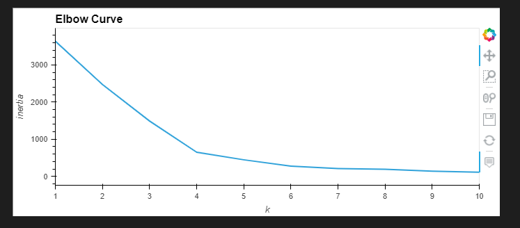
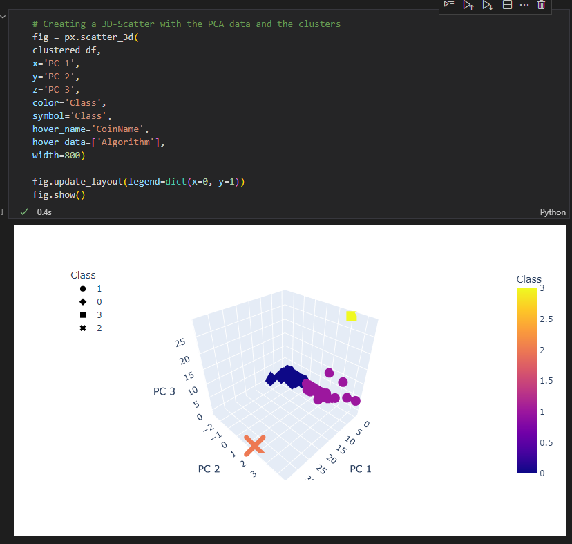
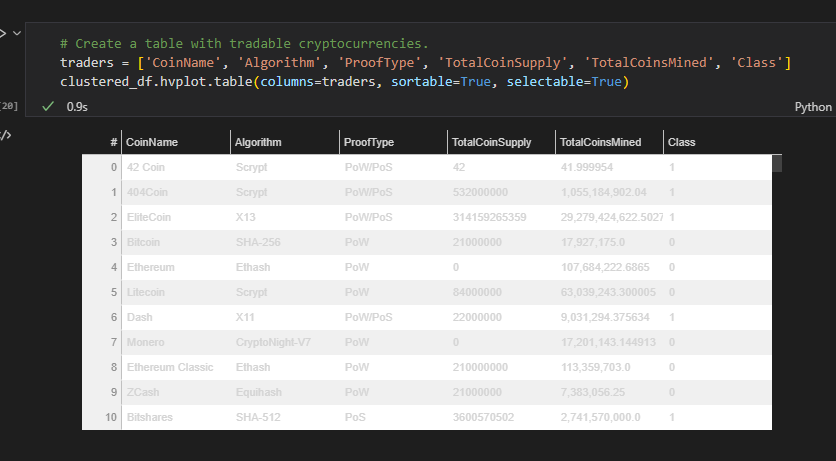
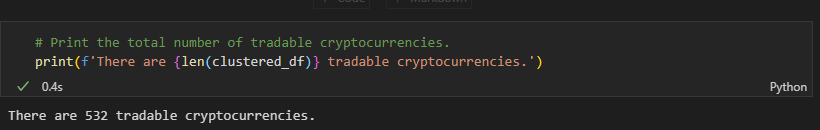
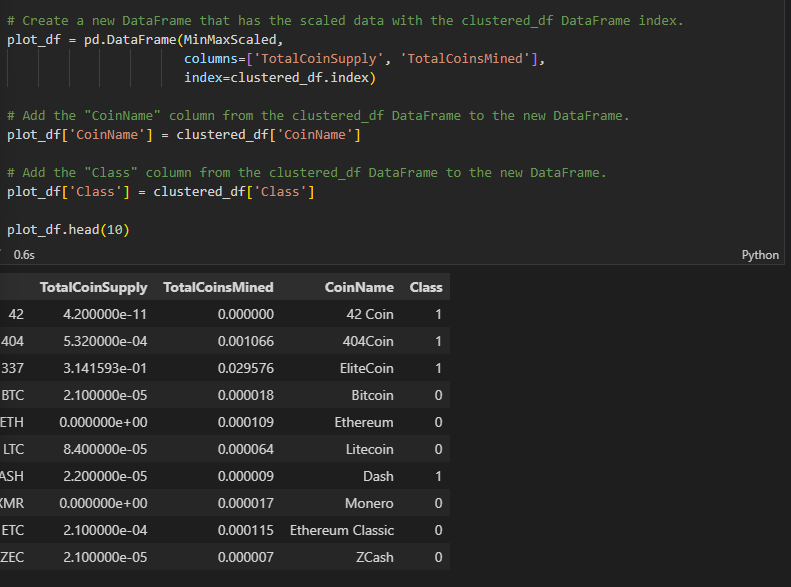
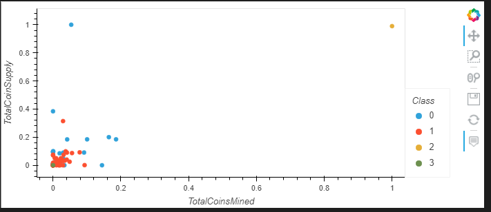

# Cryptocurrencies

The purpose of this challenge was to create a report of what cryptocurrencies are on the trading market and how they could be grouped to create a classification system for a new investment at an imaginary Accounting firm.  Using unsupervised learning, the data was processed, clustered, reduced in dimensions and principal components using PCA to create an analysis for the clients.

Some of the images did not show up on the uploaded file, likely due to a memory leak in Windows error, but images of the deliverables from the code are included here:
## Deliverable 3

### Elbow Curve

## Deliverable 4

### 3D Scatter Plot

### New Table with tradeable cryptocurrencies

### Printed total number of Cryptocurries

### New Dataframe

### Scatter Plot

